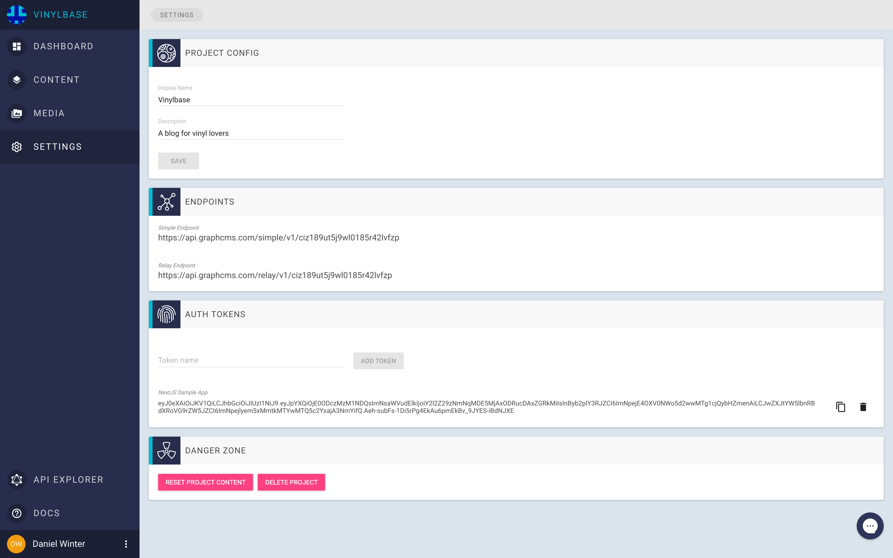

# Serverside rendered App with Next.js, Apollo and GraphCMS

[Live Demo](https://vinylbase-lfiecdwxri.now.sh/)

This example shows a small demo of how to build a [Next.js](https://github.com/zeit/next.js/), [Apollo](http://www.apollodata.com/) and [GraphCMS](https://graphcms.com) web application.

To connect your app you have to setup a new GraphCMS project and create the required content models as described [here](https://graphcms.com/docs/Examples/#serverside-rendered-app-with-nextjs-and-apollo).

Authorization is done via environment variables. You need to setup the endpoint url and the permanent auth token as variables with name: `GRAPHCMS_API` and `TOKEN`.

To get this information, log into GraphCMS and go to your project settings.

Copy the Endpoint URL for the `Simple Endpoint` from the `ENDPOINTS` section. To create a token, fill out the form within the `AUTH TOKENS` section and copy the token content.

## Installation

`npm install`

## Starting

`npm run start`

## Deployment

Install now:

`npm install -g now`

Deploy the app:

`now -e GRAPHCMS_API='YOUR_ENDPOINT' -e TOKEN='YOUR_TOKEN'`
